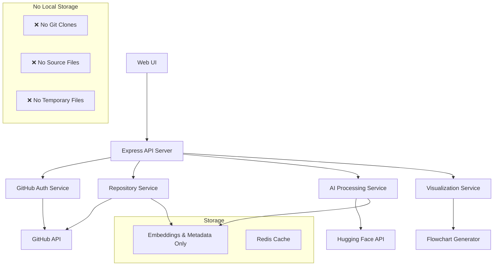

# Design Document

## Overview

The AI Project Analyzer is a full-stack web application that combines repository analysis, AI-powered insights, and interactive visualization. The system follows a microservices-inspired architecture with clear separation between repository ingestion, AI processing, visualization generation, and user interface components.

The application extends the existing Express.js server infrastructure and adds specialized services for GitHub integration, Hugging Face AI processing, and dynamic flowchart generation.

## Architecture

### High-Level Architecture



### System Components

1. **Frontend (React/Vue.js)**
   - Repository input interface
   - Interactive flowchart viewer
   - AI chat interface
   - Progress indicators and status displays

2. **Backend API (Express.js)**
   - RESTful endpoints for all operations
   - WebSocket support for real-time updates
   - Authentication middleware
   - Rate limiting and security

3. **Repository Service**
   - GitHub API integration
   - Direct file streaming from GitHub
   - File structure analysis via API
   - Dependency mapping from package files

4. **AI Processing Service**
   - Hugging Face GPT OSS integration
   - RAG knowledge base creation
   - Semantic search implementation
   - Context-aware response generation

5. **Visualization Service**
   - Abstract Syntax Tree (AST) parsing
   - Dependency graph generation
   - Interactive flowchart creation
   - Node relationship mapping

## Components and Interfaces

### Repository Service Interface

```javascript
class RepositoryService {
  async analyzeRepository(owner, repo, credentials) {
    // Stream repository structure via GitHub API
    // Returns: { files, structure, dependencies, metadata }
  }
  
  async validateAccess(owner, repo, credentials) {
    // Verify repository accessibility via API
    // Returns: { accessible, error, repoInfo }
  }
  
  async streamFileContent(owner, repo, filePath, credentials) {
    // Stream individual file content from GitHub API
    // Returns: { content, metadata, sha }
  }
  
  async getRepositoryTree(owner, repo, credentials) {
    // Get complete file tree structure
    // Returns: { tree, totalFiles, languages }
  }
}
```

### AI Processing Service Interface

```javascript
class AIService {
  async createRAGIndexFromStream(owner, repo, credentials) {
    // Stream files from GitHub API and build RAG index
    // Returns: { indexId, status, documentCount }
  }
  
  async processFileForRAG(filePath, content, sha) {
    // Process individual file content into embeddings
    // Returns: { chunks, embeddings, metadata }
  }
  
  async queryRepository(question, indexId) {
    // Process natural language queries
    // Returns: { answer, sources, confidence }
  }
  
  async generateSummary(codeSection, filePath) {
    // Create AI summaries for code components
    // Returns: { summary, purpose, complexity }
  }
}
```

### Visualization Service Interface

```javascript
class VisualizationService {
  async generateFlowchart(repositoryStructure) {
    // Create interactive flowchart data
    // Returns: { nodes, edges, layout, metadata }
  }
  
  async updateFlowchart(changes, existingChart) {
    // Incrementally update visualization
    // Returns: { updatedNodes, updatedEdges }
  }
}
```

## Data Models

### Repository Model

```javascript
{
  id: String,
  url: String,
  name: String,
  owner: String,
  isPrivate: Boolean,
  lastAnalyzed: Date,
  structure: {
    files: Array,
    directories: Array,
    dependencies: Object,
    languages: Array
  },
  metadata: {
    size: Number,
    commitCount: Number,
    contributors: Array,
    lastCommit: Date
  }
}
```

### RAG Index Model

```javascript
{
  repositoryId: String,
  documents: Array,
  embeddings: Array,
  metadata: {
    createdAt: Date,
    documentCount: Number,
    indexSize: Number
  }
}
```

### Flowchart Model

```javascript
{
  repositoryId: String,
  nodes: [{
    id: String,
    type: String, // file, class, function, module
    label: String,
    position: { x: Number, y: Number },
    metadata: {
      filePath: String,
      lineNumber: Number,
      summary: String
    }
  }],
  edges: [{
    source: String,
    target: String,
    type: String, // import, call, inherit, reference
    weight: Number
  }]
}
```

## Error Handling

### Authentication Errors
- Invalid GitHub tokens: Clear error messages with token validation guidance
- SSH key issues: Specific error codes for different SSH problems
- Rate limiting: Graceful degradation with retry mechanisms

### Repository Processing Errors
- GitHub API rate limits: Intelligent batching and retry with exponential backoff
- Large file handling: Stream processing with size limits and chunking
- Unsupported file types: Skip with warnings, continue processing
- API failures: Graceful degradation with partial analysis results

### AI Service Errors
- Hugging Face API failures: Retry logic with exponential backoff
- Context length limits: Intelligent chunking and summarization
- Model unavailability: Fallback to cached responses or alternative models

### Visualization Errors
- Complex graph rendering: Performance optimization and simplification
- Browser compatibility: Progressive enhancement approach
- Memory constraints: Lazy loading and virtualization

## Testing Strategy

### Unit Testing
- Repository parsing logic with mock Git repositories
- AI service integration with test fixtures
- Visualization generation with known code structures
- Authentication flows with mock GitHub responses

### Integration Testing
- End-to-end repository analysis workflows
- AI query accuracy with curated test datasets
- Flowchart generation and interaction testing
- Security testing for credential handling

### Performance Testing
- Large repository processing benchmarks
- Concurrent user analysis scenarios
- Memory usage optimization validation
- API response time monitoring

### Security Testing
- Credential handling and storage validation
- Input sanitization for repository URLs
- Rate limiting effectiveness
- HTTPS enforcement and data encryption

## Security Considerations

### Credential Management
- Environment variable storage for API keys
- In-memory only storage for user tokens
- Automatic credential cleanup after sessions
- No logging of sensitive authentication data

### Repository Access
- Direct GitHub API access with user credentials
- No local storage of repository content ever
- Stream-only processing with immediate disposal
- Zero server-side storage of private repository data

### API Security
- Rate limiting per user and endpoint
- Input validation and sanitization
- CORS configuration for frontend access
- Authentication middleware for protected routes

### Data Privacy
- Temporary processing of repository content
- No long-term storage of private code
- Encrypted communication with external APIs
- Clear data retention policies

## Performance Optimization

### Caching Strategy
- Repository metadata caching with Redis
- AI response caching for common queries
- Flowchart data caching with invalidation
- Progressive loading for large visualizations

### Scalability Considerations
- Horizontal scaling for AI processing
- Queue-based repository analysis
- CDN integration for static assets
- Database optimization for search operations

### Resource Management
- Memory limits for repository processing
- Timeout configurations for external APIs
- Cleanup jobs for temporary files
- Connection pooling for database access